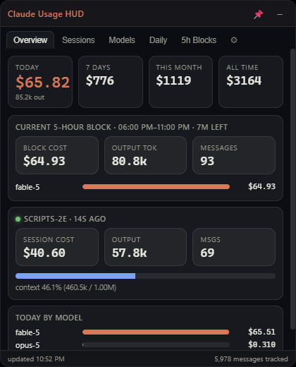

# Claude Usage HUD

A translucent, always-on-top desktop overlay that shows **live cost and token usage for Claude Code** — per session, per model, per day, and per 5-hour rate-limit window. Everything is computed locally from the transcript files Claude Code already writes to `~/.claude/projects`; nothing is sent anywhere.



## Why

Different models cost very different amounts (Fable 5 is $10/$50 per MTok, Opus 5 is $5/$25, Sonnet 5 is $3/$15, Haiku 4.5 is $1/$5 — and cache reads/writes bill at 0.1× / 1.25× / 2× the input rate). This HUD keeps that cost visible while you work so you can build an intuition for what different jobs and models actually consume.

On a Pro/Max subscription the numbers are **API-equivalent value**, not a bill — still the best single yardstick for "how big was that job?"

## Features

- **Overview** — today / 7-day / month / all-time cost, the current 5-hour block with time remaining, and live sessions with per-session cost and **context-window fill %**
- **Sessions** — every session with duration, token breakdown (in / out / cache-read / cache-write), and cost
- **Models** — cost share per model, full token-type breakdown
- **Daily** — 30-day bar chart and table
- **5h Blocks** — usage grouped into the same 5-hour windows the subscription rate limits use
- **Settings** — idle opacity, refresh interval, always-on-top, launch-at-login, and a fully editable pricing table

### Overlay behavior

- Translucent when idle, fades to full opacity on hover
- Drag anywhere on the title bar; resize from any edge
- **Pin** (📌 button, tray menu, or `Ctrl+Alt+U`): the window becomes click-through — you can click straight through it while it stays visible. Unpin from the tray icon or `Ctrl+Alt+U`
- Lives in the system tray; closing just hides it

## Install

**From a release:** download the installer (`Claude Usage HUD-x.y.z-x64.exe`) or the portable exe from the Releases page and run it.

**From source:**

```bash
git clone https://github.com/icspin/claude-usage-hud
cd claude-usage-hud
npm install
npm start
```

Build a Windows installer + portable exe:

```bash
npm run dist
```

## How it works

Claude Code logs every assistant message — with model id and exact token usage (input, output, cache reads, and cache writes split by 5-minute vs 1-hour TTL) — to JSONL transcripts under `~/.claude/projects/`. The HUD:

1. Scans those files (incrementally — only re-parsing files that changed)
2. Deduplicates streamed messages by message id + request id
3. Prices each message with a configurable per-model rate table
4. Aggregates by session, model, day, and 5-hour block

Set `CLAUDE_CONFIG_DIR` if your Claude config lives somewhere other than `~/.claude`.

## Default pricing (USD per 1M tokens)

| Model | Input | Output |
|---|---|---|
| Fable 5 / Mythos 5 | $10 | $50 |
| Opus 5 / 4.8 / 4.7 / 4.6 / 4.5 | $5 | $25 |
| Opus 4.1 / 4.0 | $15 | $75 |
| Sonnet (all) | $3 | $15 |
| Haiku 4.5 | $1 | $5 |
| Haiku 3.5 | $0.80 | $4 |

Cache read = 0.1× input · cache write = 1.25× (5m TTL) / 2× (1h TTL). All of it is editable in **Settings → Pricing** (e.g. Sonnet 5's intro pricing of $2/$10 through 2026-08-31).

## Privacy

100% local. The app reads files from your `~/.claude` directory and renders them. No network requests, no telemetry.

## License

MIT
